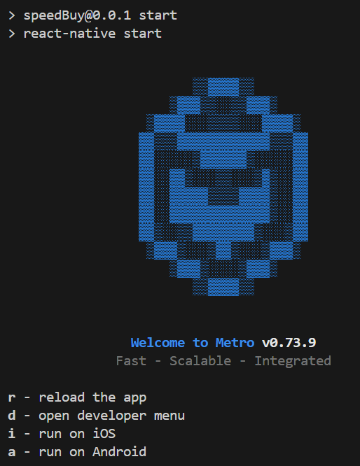

# Introduction
I implemented an online shop frame work using react-native, which is tested on Android Studio. Until now, I have done a few pages including main-shop, product-info, cart, and checkout.
# Setup
1. Install Android Studio and configure. You can refer to this tutorial. [Tutorial](https://reactnative.dev/docs/set-up-your-environment)
2. Open Android Studio and add a virtual device. Below is the recommended device configuration. 
3. Clone the project, enter the project directory, and run `npm install`
4. Run `npm run start`, and you will see the instruction below. Enter `a` to run on android. 
5. You will see the project is installed on the virtual device.
# Demo Video

   
